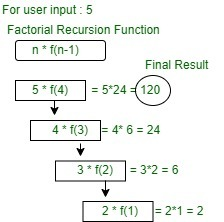

# Class 2: Testings and Modules

## Links and Resources

- [In Tests We Trust - TDD with Python](https://code.likeagirl.io/in-tests-we-trust-tdd-with-python-af69f47e6932)
- [Recursion](https://www.geeksforgeeks.org/recursion/)
- [What on Earth is Recursion](https://www.youtube.com/watch?v=Mv9NEXX1VHc)
- [Python Modules and Packages Companion Video](https://realpython.com/courses/python-modules-packages/)
- [Google for Education: Python Lists](https://developers.google.com/edu/python/lists)
- [Google for Education: Python Strings](https://developers.google.com/edu/python/strings)
- [Python Modules and Packages](https://realpython.com/python-modules-packages/)
- [Pytest Documentation](https://docs.pytest.org/en/latest/)
- [PyTest Tutorial](https://www.guru99.com/pytest-tutorial.html)

## Notes

### Test Driven Development

- Unit testing is used to exercise the input, output, and behavior of code
- Test-Driven Development is a strategy to think and write tests first
- be descriptive with test names
- test file name should be the same as module name
- separate test folder from production code and have similar structure

example:

```
mymodule/
 — module.py
 — another_folder/
 — — another_module.py
tests/
 — test_module.py
 — another_folder/
 — — test_another_module.py
```

- Structure of test: AAA - Arrange, Act, Assert

  - Arrange: you need to organize the data needed to execute that piece of code (input)
  - Act: here you will execute the code being tested (exercise the behaviour)
  - Assert: after executing the code, you will check if the result (output) is the same as you were expecting

- TDD test cycle:

  - Write a unit test and make it fail
  - Write the feature and make the test pass
  - Refactor the code — the first version doesn’t need to be the beautiful one

- The greatest advantage about TDD is to craft the software design first
- Your code will be more reliable: after a change you can run your tests and be in peace
- Beginning may be hard — and that’s fine. You just need to practice!

### Recursion

- Recursion is the process in which a function calls itself
- The idea is to represent a problem in terms of one or more smaller problems and a base condition to stop the recursion
- Direct vs Inderect - whether a function calls itself or another function
- Tail vs NonTail - considered tail when recursive call is the last thing executed by the function
- Recursive programs have greater space requirements than iterative

Examples:

```python
# Python code to implement Fibonacci series

# Function for fibonacci
def fib(n):

 # Stop condition
 if (n == 0):
  return 0

 # Stop condition
 if (n == 1 or n == 2):
  return 1

 # Recursion function
 else:
  return (fib(n - 1) + fib(n - 2))


# Driver Code

# Initialize variable n.
n = 5;
print("Fibonacci series of 5 numbers is :",end=" ")

# for loop to print the fiboancci series.
for i in range(0,n):
 print(fib(i),end=" ")
```

```python
# Python code to implement Fibonacci series

# Function for fibonacci
def fib(n):

 # Stop condition
 if (n == 0):
  return 0

 # Stop condition
 if (n == 1 or n == 2):
  return 1

 # Recursion function
 else:
  return (fib(n - 1) + fib(n - 2))


# Driver Code

# Initialize variable n.
n = 5;
print("Fibonacci series of 5 numbers is :",end=" ")

# for loop to print the fiboancci series.
for i in range(0,n):
 print(fib(i),end=" ")
```


